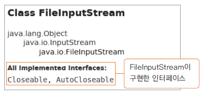

# 예외 처리하기와 미루기

## try-catch 문

- try 블록에는 예외가 발생할 가능성이 있는 코드를 작성하고 try 블록 안에서 예외가 발생하믄 경우 catch 블록이 수행됨


- 프로그래머가 예외를 처리해줘야 하는 예 (배열의 오류 처리)
```java
public class ArrayExceptionHandling {

	public static void main(String[] args) {
		int[] arr = {1,2,3,4,5};
		try{
			for(int i=0; i<=5; i++){
				System.out.println(arr[i]);
			}
		}catch(ArrayIndexOutOfBoundsException e){
			System.out.println(e);
		}
		System.out.println("비정상 종료되지 않았습니다.");
	}
}
```

## try-catch-finally 문

- finally 블럭에서 파일를 닫거나 네트웍을 닫는 등의 리소스 해제 구현을 함

- try{} 블럭이 수행되는 경우, finally{} 블럭은 항상 수행 됨

- 여러 개의 예외 블럭이 있는 경우 각각에서 리소스를 해제하지 않고 finally 블록에서 해제하도록 구현함

- 컴파일러에 의해 예외가 처리 되는 예 (파일 에러 처리)

```java
public class FileExceptionHandling {

	public static void main(String[] args) {
		FileInputStream fis = null;
		try {
			fis = new FileInputStream("a.txt");
		} catch (FileNotFoundException e) {
			System.out.println(e);
			//return;
		}finally{
			if(fis != null){
				try {
					fis.close();
				} catch (IOException e) {
					// TODO Auto-generated catch block
					e.printStackTrace();
				}
			}
			System.out.println("항상 수행 됩니다.");
		}
		System.out.println("여기도 수행됩니다.");
	}
}
```

## try-with-resources문

- 리소스를 사용하는 경우 close() 하지 않아도 자동으로 해제 되도록 함

- 자바 7부터 제공되는 구문

- 리소스를 try() 내부에서 선언해야만 함

- close()를 명시적으로 호출하지 않아도 try{}블록에서 열린 리소스는 정상적인 경우나 예외가 발생한 경우 모두 자동으로 해제됨

- 해당 리소스 클래스가 AutoCloseable 인터페이스를 구현 해야 함

- FileInputStream의 경우에는 AutoCloseable을 구현하고 있음

- 자바 9 부터 리소스는 try() 외부에서 선언하고 변수만을 try(obj) 와 같이 사용할 수 있음



- AutoCloseable인터페이스 구현 실습

```java
public class AutoCloseObj implements AutoCloseable{

	@Override
	public void close() throws Exception {
		System.out.println("리소스가 close() 되었습니다");
	}
}
```

```java
public class AutoCloseTest {
	
	public static void main(String[] args) {
		
	    AutoCloseObj obj = new AutoCloseObj();
    	try (obj){
			throw new Exception();
		}catch(Exception e) {
			System.out.println("예외 부분 입니다");
		}
	}
}
```

## 예외 처리 미루기

- 예외 처리는 예외가 발생하는 문장에서 try-catch 블록으로 처리하는 방법과 이를 사용하는 부분에서 처리하는 방법 두 가지가 있음

- throws를 이용하면 예외가 발생할 수 있는 부분을 사용하는 문장에서 예외를 처리할 수 있음


```java
public class ThrowsException {

	public Class loadClass(String fileName, String className) throws FileNotFoundException, ClassNotFoundException{
		FileInputStream fis = new FileInputStream(fileName); //FileNotFoundException 발생
		Class c = Class.forName(className);  //ClassNotFoundException 발생
		return c;
	}

	public static void main(String[] args) {

		ThrowsException test = new ThrowsException();
		
		try {
			test.loadClass("a.txt", "java.lang.String");
		
		}catch (FileNotFoundException e) {
			e.printStackTrace();
		} catch (ClassNotFoundException e) {
			e.printStackTrace();
		}catch (Exception e) {
			e.printStackTrace();
		}
	}
}
```

## 하나의 try{}블록에서 예외가 여러개 발생하는 경우

- 여러개의 예외가 발생하는 경우 예외를 묶어서 하나의 방법으로 처리할 수도 있고,

```java
	try {
	test.loadClass("a.txt", "java.lang.String");
	} catch (FileNotFoundException | ClassNotFoundException e) {
		e.printStackTrace();
	}
```

- 각각의 예외를 따로 처리할 수도 있음

```java
		try {
			test.loadClass("a.txt", "java.lang.String");
		
		}catch (FileNotFoundException e) {
			e.printStackTrace();
		} catch (ClassNotFoundException e) {
			e.printStackTrace();
		}catch (Exception e) {
			e.printStackTrace();
		}
```
- Exception 클래스를 활용하여 defualt 처리를 할 때 Exception 블록은 맨 마지막에 위치해야 함

